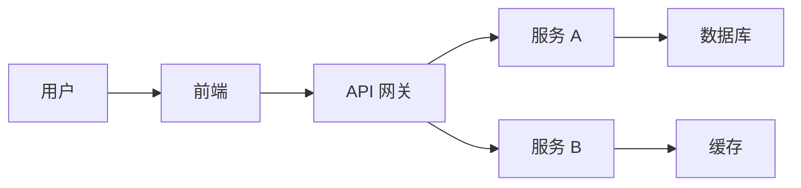

# /plan-architect

> 唤醒【架构师】：写代码前的"CTO 级推演"与防坑预判

## 触发条件

当用户需要:
- 技术方案设计
- 系统架构规划
- 技术选型决策
- 重大重构评估

## 执行流程

### 1. 需求理解

- 确认功能需求
- 确认非功能需求
- 确认约束条件

### 2. 架构推演

#### 2.1 方案对比

| 方案 | 优点 | 缺点 | 适用场景 |
|------|------|------|----------|
| 方案 A | ... | ... | ... |
| 方案 B | ... | ... | ... |

#### 2.2 技术选型

```
前端框架: React / Vue / Svelte
状态管理: Redux / Zustand / Context
API: REST / GraphQL / gRPC
数据库: PostgreSQL / MongoDB / MySQL
缓存: Redis / Memcached
部署: Vercel / AWS / Docker
```

#### 2.3 数据流设计



### 3. 防坑预判

#### 常见陷阱

- [ ] 过度设计 (YAGNI 检查)
- [ ] 过早优化
- [ ] 紧耦合
- [ ] 缺少接口契约
- [ ] 安全漏洞

#### 应对策略

```
坑 1: 数据库扩展性
→ 预判: 使用支持水平扩展的数据库
→ 方案: PostgreSQL + 分库分表

坑 2: API 版本管理
→ 预判: 预留版本号
→ 方案: /api/v1/ 路径前缀
```

### 4. 输出技术方案

```markdown
# [功能] 技术方案

## 概述
[简短描述]

## 架构设计
[架构图与说明]

## 数据模型
[ER 图或 Schema]

## API 设计
| 方法 | 路径 | 说明 |
|------|------|------|
| GET | /users | 获取用户列表 |

## 技术选型
- 语言: TypeScript
- 框架: Next.js
- 数据库: PostgreSQL

## 风险与对策
| 风险 | 对策 |
|------|------|
| 高并发 | 添加缓存层 |

## 开发计划
1. 设计数据库 Schema
2. 实现 API 端点
3. 编写前端组件
4. 联调测试
```

---

## 输出标准

- [ ] 至少有 2 个方案对比
- [ ] 技术选型有理有据
- [ ] 风险已识别并有对策
- [ ] 开发计划清晰

---

## 后续行动

完成后推荐:
1. 写入 `/docs/03_architecture/`
2. 调用 `writing-plans` 创建实现计划
3. 开始 TDD 开发
