# 🧑‍💻 AI Native 脚手架导航

> 基于 AI-原生开发方法论的内部标准脚手架，支持 git subtree 分发到多个项目。

## 项目概览

| 属性 | 值 |
|------|-----|
| 脚手架版本 | v2.1.1 |
| 更新时间 | 2026-04-07 |

## 目录结构

```
.
├── CLAUDE.md              # 🤖 AI 行为总入口
├── SCAFFOLD_VERSION       # 脚手架版本号
├── CHANGELOG.md           # 版本变更记录
├── CLAUDE.local.md.template  # 本地配置覆盖模板（实际文件不提交）
│
├── .agents/               # 🤖 Agent 技能扩展（gstack / OMC 等）
│   └── skills/
│
├── .claude/               # 🧠 AI 行为层 (Layer 0)
│   ├── rules/             # 📜 核心准则（全局加载）
│   ├── commands/          # ⚡ Slash Commands
│   ├── agents/            # 🎭 专属 Agent（后台运行）
│   ├── skills/            # 🛠️ 技能工具箱（gstack + OMC + 自定义）
│   └── project-config.json # ⚙️ 角色配置（currentRole、gitUser）
│
├── scripts/               # 🔧 脚手架工具脚本
│   ├── replace-placeholders.sh   # 新项目初始化
│   ├── sync-agents-skills.sh     # gstack 升级同步
│   └── sync-omc-skills.sh        # OMC 升级同步
│
├── memory/                # 🧠 跨会话记忆体 (RAM/动态上下文)
│   ├── active-task.md     # 当前进行中的核心大纲与拆解任务树
│   ├── handoff.md         # 跨会话交接信、进度阻碍与状态留存
│   └── project-facts.md   # 本项目隐藏的踩坑经验与反省铁律
│
└── docs/                  # 📖 固化知识库 (ROM/长时记忆)
    ├── 00_AI_NATIVE_SOP.md# 👑 核心操作大纲 (SOP 必读教程)
    ├── 00_ai_system/      # AI 系统与命令设计规范
    ├── 01_product/        # 产品文档（PRD、业务规则）
    ├── 02_design/         # 设计规范（设计系统、UI 资产）
    ├── 03_architecture/   # 架构设计（API、数据库、流程）
    ├── 04_qa/             # 测试用例 + 审计日志
    ├── 05_ops/            # 运维手册（部署、Runbook）
    └── 06_handbooks/      # 各角色操作手册与技能查询索引
```

---

## Commands vs Skills vs Agents

三者都是 AI 的"扩展能力"，但定位不同：

| 特性 | Commands | Skills | Agents |
|------|----------|--------|--------|
| 复杂度 | 简单，一个文件 | 复杂，多文件工作流 | 专职同事,独立子任务 |
| 结构 | 单个 `.md` 文件 | `SKILL.md` + 关联文件 | `.md` + YAML frontmatter |
| 运行方式 | 主对话内执行 | 主对话内执行 | **后台独立运行** |
| 输出 | 内联输出 | 内联输出 | **只返回最终报告** |
| 适用场景 | 快速触发单一任务 | 需要详细指导的工作流 | 大规模分析、审查 |
| 示例 | `/review` 触发审查 | `/browse` 浏览器自动化 | `security-auditor` 扫描全库 |




### Commands — 轻量级心智/视角控制

一个 `.md` 文件就是一个命令。仅用于改变当前上下文心智，复杂的重型工作流（如代码审查/发布）全部交由 Skills 引擎处理。

```
.claude/commands/
├── switch-role.md     # 角色视角强制切换
├── handoff.md         # 强行拉起断点交接程序存档
└── autoresearch.md    # 挂载自主迭代探索引擎提示词
```

### Skills — 复杂工作流

`SKILL.md` 可以引用旁边的文件，适合多步骤、需要详细规则的工作流：

```markdown
# SKILL.md
@DETAILED_GUIDE.md     # 引用详细规则
@../utils/helper.ts    # 引用工具函数
```

```
.claude/skills/
├── gstack/                   # 虚拟工程团队工具（vendored）
├── omc/                      # oh-my-claudecode 多智能体编排（vendored）
├── springboot-tdd/           # Spring Boot TDD 测试工作流
├── springboot-patterns/      # Spring Boot 后端高级架构模式
├── java-coding-standards/    # Java 语言规范校验
├── frontend-patterns/        # 现代前端规范与实践体系
├── api-design/               # API 服务防腐与设计规范
├── e2e-testing/              # 自动化端到端测试集成
└── ai-native-scaffold-init/  # 新项目初始化
```

### Agents — 后台专家

Agent 在后台启动独立子任务，只把最终报告返回到主对话，不刷屏中间过程。适合大规模分析类任务。

```
.claude/agents/
├── frontend-reviewer.md    # 前端代码审查 (TypeScript/React/Vue)
├── java-reviewer.md        # Java 后端审查 (Spring Boot)
├── python-reviewer.md      # Python 后端审查 (FastAPI)
├── security-auditor.md     # OWASP 安全扫描
└── performance-analyzer.md # 全链路性能分析
```

Agent 文件通过 YAML frontmatter 声明可用工具和模型，限制权限：

```yaml
---
name: security-auditor
description: 安全审计员，OWASP 漏洞扫描时调用
tools: [Read, Grep, Glob]
model: sonnet
---
```

---

## 快速开始

### 方式一（推荐）：让 Claude Code 自动完成接入

打开你的项目，启动 Claude Code，把下面这段话发给它，CC 会自动执行所有步骤：

**后端项目接入示例：**
```
我需要把 AI Native 脚手架接入当前项目。

脚手架 GitLab 地址：http://gitlab-iot.yunzhisheng.cn/med-ai/med-ai-native-collaboration.git
当前项目是 Java Spring Boot 后端项目，我的角色是 delivery-engineer，gitUser 是 xxx@email.com

请帮我：
1. 把脚手架以 git subtree 方式引入到 .scaffold/ 目录（remote 名称用 scaffold）
2. 把 CLAUDE.md、.claude/、.agents/、docs/、memory/ 复制到项目根目录
3. 更新 .claude/project-config.json，初始化基本项目环境参数
4. 告诉我后续如何更新脚手架

注意：不要改动现有 src/ 代码和 pom.xml。
```

**全栈项目接入示例：**
```
我需要把 AI Native 脚手架接入当前项目。

脚手架 GitLab 地址：http://gitlab-iot.yunzhisheng.cn/med-ai/med-ai-native-collaboration.git
当前项目是前后端分离的全栈项目：
- 前端：React 18 + TypeScript + Next.js 14（src/frontend/）
- 后端：Python 3.11 + FastAPI（src/backend/）
- 数据库：PostgreSQL + Redis
我的角色是 delivery-engineer，gitUser 是 xxx@email.com

请帮我：
1. 把脚手架以 git subtree 方式引入到 .scaffold/ 目录（remote 名称用 scaffold）
2. 把 CLAUDE.md、.claude/、.agents/、docs/、memory/ 复制到项目根目录
3. 更新 .claude/project-config.json，初始化基本项目环境参数
4. 告诉我后续如何更新脚手架

注意：不要改动现有 src/ 代码、pom.xml、requirements.txt。
```

CC 会逐步执行并在每个关键操作前说明做什么，你确认后它继续。全程大约 2 分钟。

> **如果脚手架 `main` 分支尚未包含 `.claude/` 和 `.agents/`**（本地有但未推送），可在对话中补充：
> ```
> 注意：脚手架 GitLab 上还没有 .claude/ 和 .agents/，
> 这两个目录在本地路径 /path/to/med-ai-native-collaboration，
> 请从本地复制。
> ```

---

### 方式二（手动,不推荐）：已有项目接入脚手架（git subtree）

详见 [手动接入操作手册](docs/00_ai_system/scaffold-integration-manual.md)（以 `app_insurance_cloud` Java 项目为实际案例，包含 6 个步骤、结构变化说明和后续更新方式）。

---

### 跨平台兼容性 (Windows / macOS Skills Setup)

AI 脚手架依赖大量软链接 (symlinks) 串联分散的 Skills（如 `gstack` 关联工具）。

- **macOS / Linux**：`git clone` 后即插即用，无需额外操作。
- **Windows**：Git 默认会破坏 symlinks（转为纯文本）。**请在 `git clone` 后，在 Git Bash 中运行修复脚本：**
  
  ```bash
  bash scripts/setup-skills.sh
  ```
  该跨平台脚本会自动在 Windows 环境下使用 `mklink /J`（Directory Junction，无需管理员权限）重建软链接，保证 100% 体验一致性。

> 💡 **提示**：如果有因错误操作导致的 symlinks 失效问题（全平台），随时可强制重建：
> ```bash
> bash scripts/setup-skills.sh --force
> ```

---

## 脚手架更新

当脚手架发布新版本时，在业务项目中直接运行：

```
/scaffold-upgrade
```

skill 会自动完成完整升级流程：

| 步骤 | 内容 |
|------|------|
| 1 | 检测本地版本（`.scaffold/SCAFFOLD_VERSION`）与远端最新版本 |
| 2 | 询问是否升级（支持"总是自动升级"选项） |
| 3 | `git subtree pull` 拉取最新脚手架代码 |
| 4 | 智能同步文件（覆盖 rules/agents/skills，**保护** project-config.json/memory/src） |
| 5 | 展示 CHANGELOG.md 变更摘要 |

**文件保护规则**：

| 策略 | 路径 |
|------|------|
| 覆盖（脚手架拥有） | `.claude/rules/`、`.claude/agents/`、`.agents/skills/`、`scripts/` |
| 智能检测 | `CLAUDE.md`（如被项目修改过，冲突时提示 diff） |
| 永不覆盖（项目专属） | `.claude/project-config.json`、`memory/` |

> **前提**：项目已通过 git subtree 接入脚手架（存在 `.scaffold/` 目录和 `scaffold` remote）。
> 如未接入，参考[手动接入操作手册](docs/00_ai_system/scaffold-integration-manual.md)。

---

### AI 交互命令

**脚手架轻量级心智命令 (Commands)：**
```bash
/switch-role       # 强行注入专业人设，切换工作视野
/handoff           # 强制拉起工作交接程序并更新环境存档
/autoresearch      # 挂载自主迭代引擎提示词
```

**脚手架运维及核心流转技能 (Skills)：**
```bash
/scaffold-upgrade  # 升级本 AI Native 脚手架至新版本代码
/omc-upgrade       # 升级底层 oh-my-claudecode 引擎和内置 skills
```
*(注：架构设计、测试 QA、复盘等传统"命令"，现均以独立扩展能力存在于 [Skills 体系](docs/06_handbooks/ai-native/SKILLS_INDEX.md) 中)*

**OMC 内置命令**（[oh-my-claudecode](https://github.com/Yeachan-Heo/oh-my-claudecode) vendored 版本已升级到 `4.11.2`）：
```bash
# 核心执行与编排
/deep-interview /ralplan /team /omc-teams /autopilot /ralph /ultrawork /ccg /ask

# 调试与验证
/debug /trace /verify /ultraqa /visual-verdict

# 技能沉淀与知识管理
/learner /remember /skill /skillify /wiki /deepinit

# 环境与集成
/setup /omc-setup /omc-doctor /hud /configure-notifications /mcp-setup /cancel
```

**Autoresearch**（[autoresearch](https://github.com/uditgoenka/autoresearch) 自主目标驱动迭代引擎，已内置）：
```bash
/autoresearch          # 通用自主优化循环：修改→验证→保留/丢弃→重复
/autoresearch:plan     # 将自然语言目标转化为可执行配置
/autoresearch:debug    # 科学方法驱动的 Bug 猎杀循环
/autoresearch:fix      # 自动修复错误，直到测试/构建/类型全部通过
/autoresearch:security # STRIDE + OWASP Top 10 自主安全审计
/autoresearch:ship     # 通用交付工作流（代码/内容/部署/营销）
/autoresearch:scenario # 场景驱动用例生成，探索边界与失效模式
/autoresearch:predict  # 多专家视角群体预测（架构/安全/性能）
/autoresearch:learn    # 自主学习代码库，生成/更新文档
```

### 🚀 多元角色无缝流转

**告别繁琐的手动配置，系统采用基于任务语境与内部状态机的动态流转机制**：
1. **基于上下文的隐式切换**：AI 默认以“全栈通才”身份运作。当读取到具有特定职能域属性的任务描述时（例如 `[后端] 提供 User 接口`），AI 便会在执行中自动代入对应的技术栈经验与思维方式，完成无感知的角色适应。
2. **面向深水区的强指令覆盖**：在处理需要极致专业深度的防御性或破坏性任务时，执行 `/switch-role [角色名]`。该命令底层实际上是通过强行注入高权重的系统级 Prompt，瞬间“锁死” AI 的心智边界，使其从“温和的兜底通才”强制扭转为“挑剔的垂直专家”（如严苛的 `architect` 或无情的 `qa`），依靠专业壁垒解决深度问题。
3. **全自主的 AI 专属 RAM 状态机**：真正让角色丝滑流转的，是系统将 `memory/` 完全定义为“专供 AI 流程流转的数字运存”。无论是 `active-task.md` 中的颗粒任务打钩，还是 `handoff.md` 里的跨会话防遗忘交接，均由 AI 在后台利用自身流程工具高频自主维护。这种绝对的内部状态机托管模型，确保了无论发生怎样的角色重载与终端切换，AI 都能瞬间恢复现场，对人类完全屏蔽上下文断裂的损耗。

#### AI-Native 体系 🚀（推荐）

> 按「解决什么问题」划分岗位，AI 处理语言栈技术细节

| 角色 | currentRole 值 | 说明 |
|------|---------------|------|
| 产品负责人 | `product-owner` | 需求策略、PRD、用户研究 |
| 交付工程师 | `delivery-engineer` | 端到端交付产品特性（含部署上线，替代前端/后端/全栈/运维）|
| AI 工程师 | `ai-engineer` | Agent 编排、LLM 集成、AI 流水线 |
| 质量工程师 | `quality-engineer` | 全栈测试 + 安全 + 可靠性 + 可观测性 |

详见 👉 [全局操作总纲 SOP](docs/00_AI_NATIVE_SOP.md) (基建协同铁律)

#### 传统体系 👥（过渡期）

> 保留原有岗位名称，映射到 AI-Native 角色值

| 你的岗位 | currentRole 值 | 说明 |
|---------|---------------|------|
| 产品经理 | `product-owner` | 需求策略、PRD |
| 前端工程师 | `delivery-engineer` | UI、交互、前端逻辑 |
| 后端工程师 | `delivery-engineer` | API、服务、数据层 |
| 测试工程师 | `quality-engineer` | 测试、安全、质量保障 |
| 运维工程师 | `delivery-engineer` | 基础设施、部署、监控 |
详见 [传统体系操作大全](docs/06_handbooks/traditional/README.md) | [全局操作总纲 SOP](docs/00_AI_NATIVE_SOP.md)

---

## Git Sparse Checkout

> 不同岗位只拉取自己关注的目录，不影响 push/merge

### AI-Native 体系

```bash
# 交付工程师（前端+后端+运维全覆盖）
git sparse-checkout set src ops docs memory

# AI 工程师
git sparse-checkout set src .claude .agents docs/03_architecture memory

# 质量工程师
git sparse-checkout set tests docs/04_qa docs/03_architecture memory

# 产品负责人
git sparse-checkout set docs/01_product docs/02_design memory
```

### 传统体系

```bash
# 前端工程师
git sparse-checkout set src/frontend src/shared docs/02_design docs/04_qa memory

# 后端工程师
git sparse-checkout set src/backend src/shared docs/03_architecture docs/05_ops memory

# 产品经理
git sparse-checkout set docs/01_product docs/02_design memory

# 测试工程师
git sparse-checkout set tests docs/04_qa docs/03_architecture memory

# 运维工程师
git sparse-checkout set ops docs/05_ops memory
```

---

## 文档索引

### AI 系统

| 文档 | 说明 |
|------|------|
| [全局操作总纲 SOP(必读)](docs/00_AI_NATIVE_SOP.md) | 最核心的协作规范：ROM/RAM 分区及过渡期剧本指引 |
| [Skills 速查索引](docs/06_handbooks/ai-native/SKILLS_INDEX.md) | 88 个强悍技能按 4 大职业分类，含触发方式 |
| [Commands 命令集](.claude/commands/README.md) | 轻量且高频的核心执行命令 |
| [Agents 说明](.claude/agents/README.md) | 后台分析师/测试员/监控卫士列表 |
| [AI 系统文档](docs/00_ai_system/) | 路由矩阵、subtree 接入手册 |
| [Claude Code 使用技巧：从入门到精通](docs/00_ai_system/claude-code-40-best-practices.md) | 从配置到多 Agent，40+ 个提升工作流效率的技巧 |
| [Graphify 使用手册](docs/00_ai_system/graphify-guide.md) | Graphify 知识图谱构建与查询：安装、索引、搜索、可视化 |
| [Autoresearch 使用手册](docs/00_ai_system/autoresearch-guide.md) | 自主目标驱动迭代引擎：9 个子命令完整使用指南 |

### 操作手册

| 文档 | 说明 |
|------|------|
| [AI-Native 操作手册](docs/06_handbooks/ai-native/README.md) | 4 个 AI-Native 岗位操作指南 |
| [传统体系操作手册](docs/06_handbooks/traditional/README.md) | 产品/前端/后端/QA/运维完整协作规范 |

### 产品与研发

| 文档 | 说明 |
|------|------|
| [产品文档](docs/01_product/) | PRD、业务规则 |
| [设计规范](docs/02_design/) | 设计系统、UI 资产 |
| [架构设计](docs/03_architecture/) | API 规范、数据库设计、系统流程 |
| [测试用例](docs/04_qa/) | 测试计划、审计日志 |
| [运维手册](docs/05_ops/) | 部署环境、Runbook |


> [oh-my-claudecode](https://github.com/Yeachan-Heo/oh-my-claudecode) — Claude Code 的多智能体编排系统
>
> [gstack](https://github.com/garrytan/gstack) — 将 Claude Code 转化为虚拟工程团队
>
> [autoresearch](https://github.com/uditgoenka/autoresearch) — 自主目标驱动迭代引擎，Karpathy autoresearch 理念的 Claude Code 实现
>
> [graphify](https://github.com/safishamsi/graphify) — 为代码库构建知识图谱，支持语义索引、关系查询与可视化
>
> [everything-claude-code](https://github.com/affaan-m/everything-claude-code) — 来自 Anthropic 黑客马拉松获胜者的完整 Claude Code 配置集合


---

*最后更新: 2026-04-08 by Claude Code*
