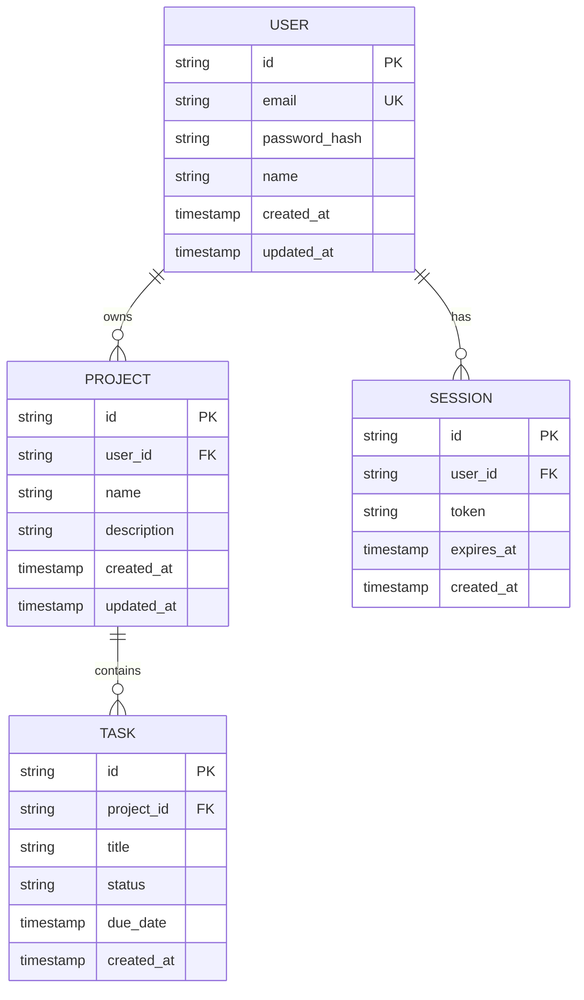

# 🗄️ 数据库结构

> 数据库表结构与索引规范 (Mermaid 语法)

---

## 1. ER 图



---

## 2. 表结构

### users 表

| 字段 | 类型 | 约束 | 说明 |
|------|------|------|------|
| id | UUID | PK | 主键 |
| email | VARCHAR(255) | UK, NOT NULL | 邮箱 |
| password_hash | VARCHAR(255) | NOT NULL | 加密密码 |
| name | VARCHAR(100) | | 用户名 |
| created_at | TIMESTAMP | NOT NULL | 创建时间 |
| updated_at | TIMESTAMP | NOT NULL | 更新时间 |

### sessions 表

| 字段 | 类型 | 约束 | 说明 |
|------|------|------|------|
| id | UUID | PK | 主键 |
| user_id | UUID | FK | 用户 ID |
| token | TEXT | NOT NULL | JWT Token |
| expires_at | TIMESTAMP | NOT NULL | 过期时间 |
| created_at | TIMESTAMP | NOT NULL | 创建时间 |

### projects 表

| 字段 | 类型 | 约束 | 说明 |
|------|------|------|------|
| id | UUID | PK | 主键 |
| user_id | UUID | FK | 所有者 |
| name | VARCHAR(50) | NOT NULL | 项目名 |
| description | TEXT | | 描述 |
| created_at | TIMESTAMP | NOT NULL | 创建时间 |
| updated_at | TIMESTAMP | NOT NULL | 更新时间 |

---

## 3. 索引

```sql
-- 用户邮箱索引 (唯一)
CREATE UNIQUE INDEX idx_users_email ON users(email);

-- 用户会话索引
CREATE INDEX idx_sessions_user_id ON sessions(user_id);
CREATE INDEX idx_sessions_token ON sessions(token);

-- 项目用户索引
CREATE INDEX idx_projects_user_id ON projects(user_id);

-- 任务项目索引
CREATE INDEX idx_tasks_project_id ON tasks(project_id);
```

---

## 4. 迁移策略

- 使用版本化迁移文件
- 每次迁移可回滚
- 迁移前备份数据

---

## 5. 种子数据

```sql
-- 示例种子数据
INSERT INTO users (id, email, password_hash, name)
VALUES ('uuid-1', 'admin@example.com', '$2b$10$...', 'Admin');
```
