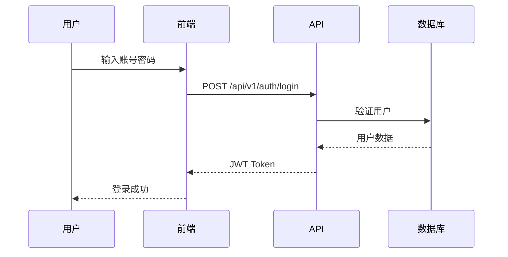
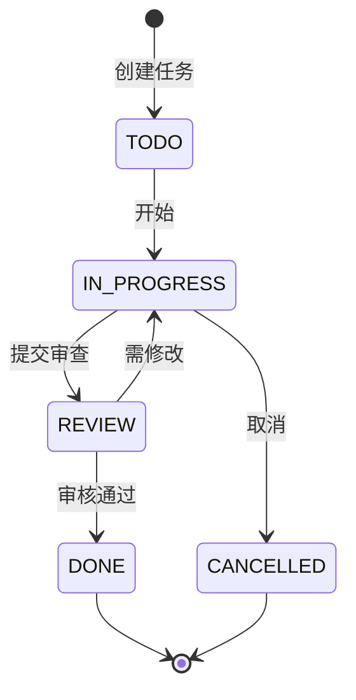
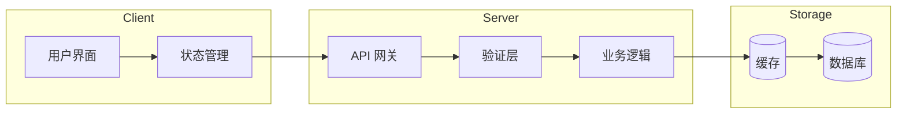
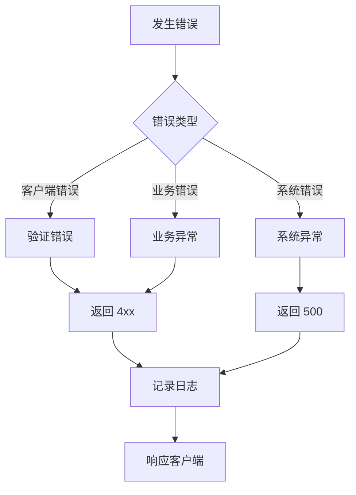

# 🔄 系统流程图

> 并发状态机与时序图

---

## 1. 用户认证流程



---

## 2. 状态机

### 任务状态



---

## 3. 数据流



---

## 4. 并发控制

### 乐观锁

```typescript
// 版本号控制并发
interface VersionedEntity {
  id: string;
  version: number;
}

async function updateWithOptimisticLock(
  entity: VersionedEntity,
  update: Partial<Entity>
) {
  const result = await db.update({
    ...update,
    version: entity.version + 1
  }).where({
    id: entity.id,
    version: entity.version
  });

  if (result.count === 0) {
    throw new ConflictError('数据已被其他请求修改');
  }
}
```

---

## 5. 错误处理流程


